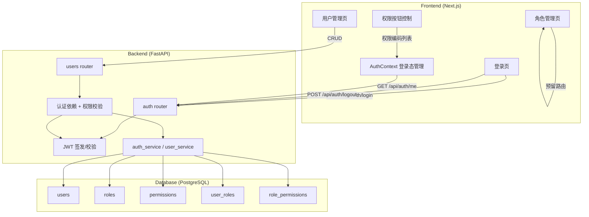
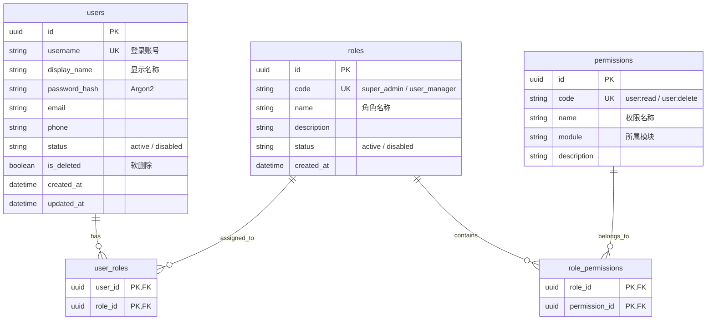
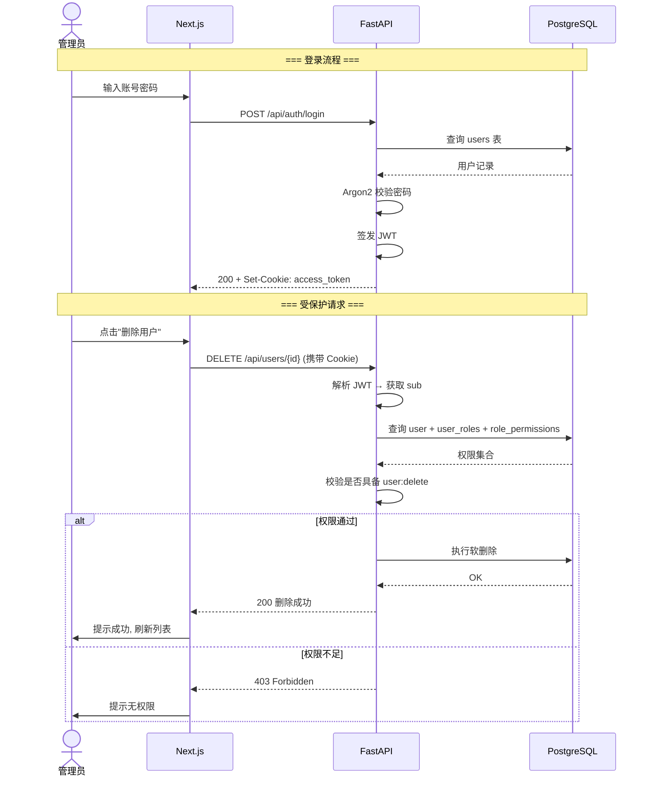
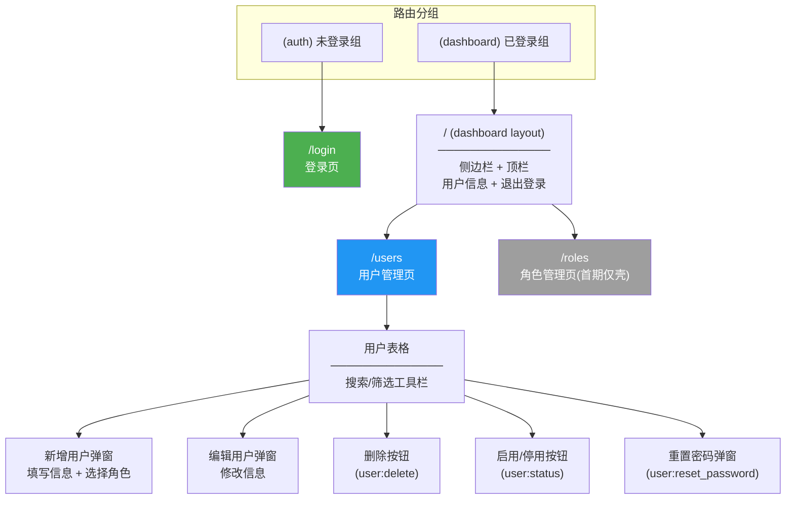
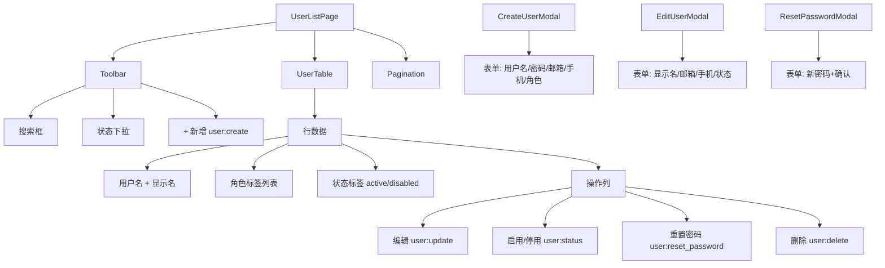
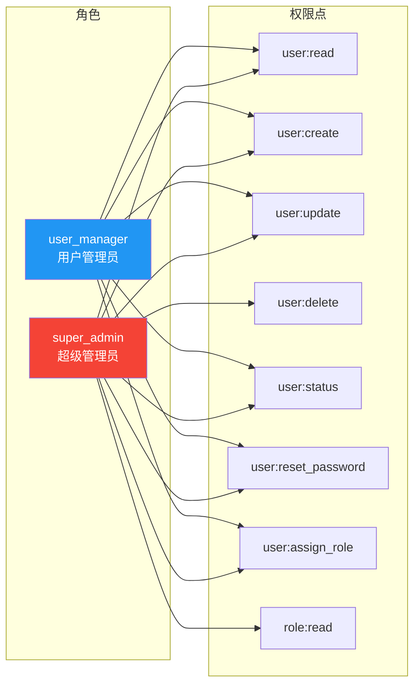
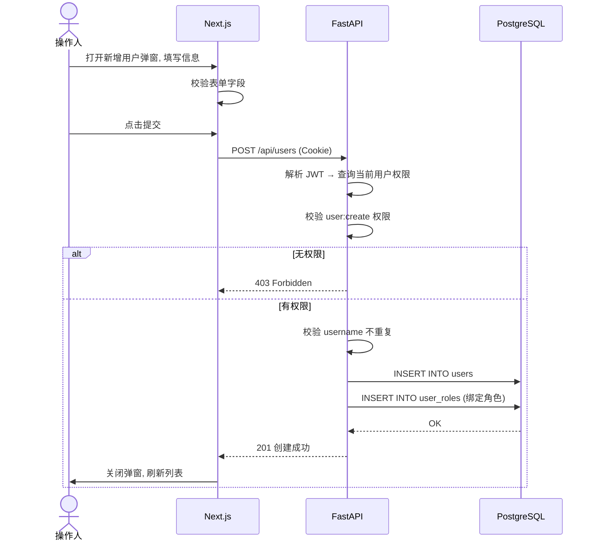

# RBAC System Design

## 1. 系统架构



---

## 2. 数据库 ER 图



---

## 3. 鉴权与权限校验流程



---

## 4. API 接口关系图

```mermaid
graph LR
    subgraph "Auth 模块 (无需鉴权)"
        LOGIN[POST /api/auth/login]
        LOGOUT[POST /api/auth/logout]
    end

    subgraph "Auth 模块 (需鉴权)"
        ME[GET /api/auth/me]
    end

    subgraph "Users 模块 (需鉴权+权限)"
        LIST[GET /api/users]
        CREATE[POST /api/users]
        UPDATE[PUT /api/users/{id}]
        DELETE[DELETE /api/users/{id}]
        STATUS[PATCH /api/users/{id}/status]
        RESET_PW[POST /api/users/{id}/reset-password]
    end

    LOGIN --> ME
    ME -->|返回用户+角色+权限| LIST

    LIST -->|user:read| LIST_V[用户列表分页]
    CREATE -->|user:create| CREATE_V[新增用户+绑定角色]
    UPDATE -->|user:update| UPDATE_V[编辑用户信息]
    DELETE -->|user:delete| DELETE_V[软删除用户]
    STATUS -->|user:status| STATUS_V[启用/停用]
    RESET_PW -->|user:reset_password| RESET_PW_V[重置密码]

    style LOGIN fill:#4CAF50,color:#fff
    style LOGOUT fill:#4CAF50,color:#fff
    style ME fill:#2196F3,color:#fff
    style LIST fill:#FF9800,color:#fff
    style CREATE fill:#FF9800,color:#fff
    style UPDATE fill:#FF9800,color:#fff
    style DELETE fill:#f44336,color:#fff
    style STATUS fill:#FF9800,color:#fff
    style RESET_PW fill:#FF9800,color:#fff
```

---

## 5. 页面结构与导航



---

## 6. 用户管理页组件树



---

## 7. 首期权限矩阵



> `super_admin` 拥有全部 8 个权限点。
> `user_manager` 拥有除 `user:delete` 和 `role:read` 外的 6 个权限点。

---

## 8. 首期完整数据流 (用户新增为例)



---

## 附：设计决策记录

| 决策点 | 选择 | 原因 |
|---|---|---|
| 技术栈 | Next.js + FastAPI + PostgreSQL | 前后端分离，清晰分层 |
| 认证 | JWT + HttpOnly Cookie | 安全性与实用性平衡 |
| 权限粒度 | 接口级 + 按钮级 | 真实后台系统标准 |
| 主键 | UUID (应用层生成) | 避免依赖 PostgreSQL uuid-ossp |
| 密码哈希 | Argon2 | 当前公认最安全的哈希算法 |
| 用户删除 | 软删除 (is_deleted) | 保留审计能力 |
| 角色绑定 | 合入用户新增/编辑接口 | 减少接口数量，降低复杂度 |
| 刷新 Token | 首期不做 | 控制在 9 个接口范围 |
| 角色管理页 | 首期仅壳 | 先聚焦用户管理 |
